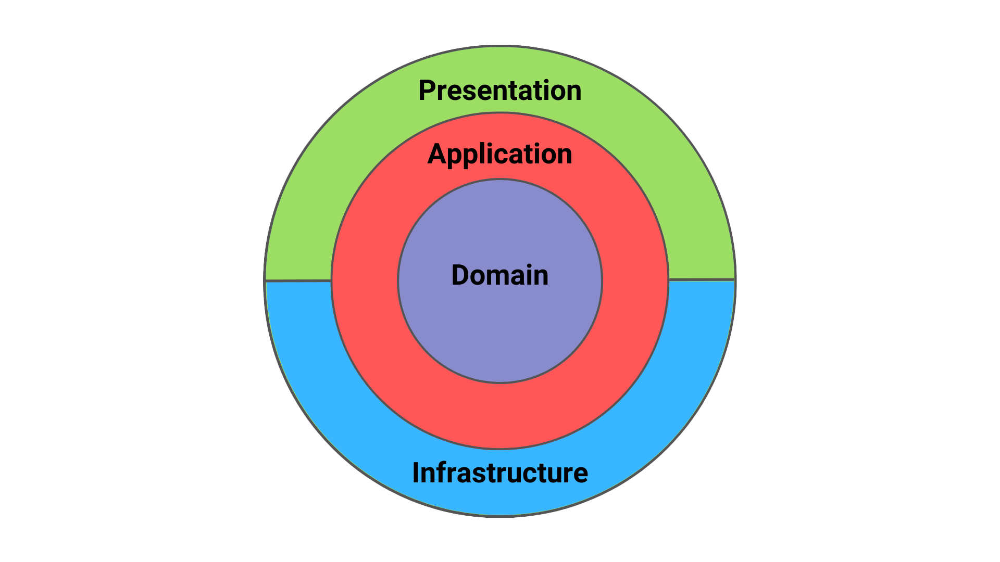
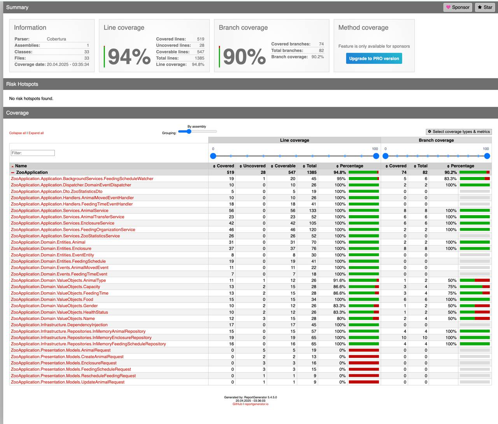
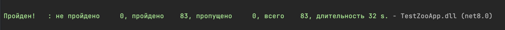
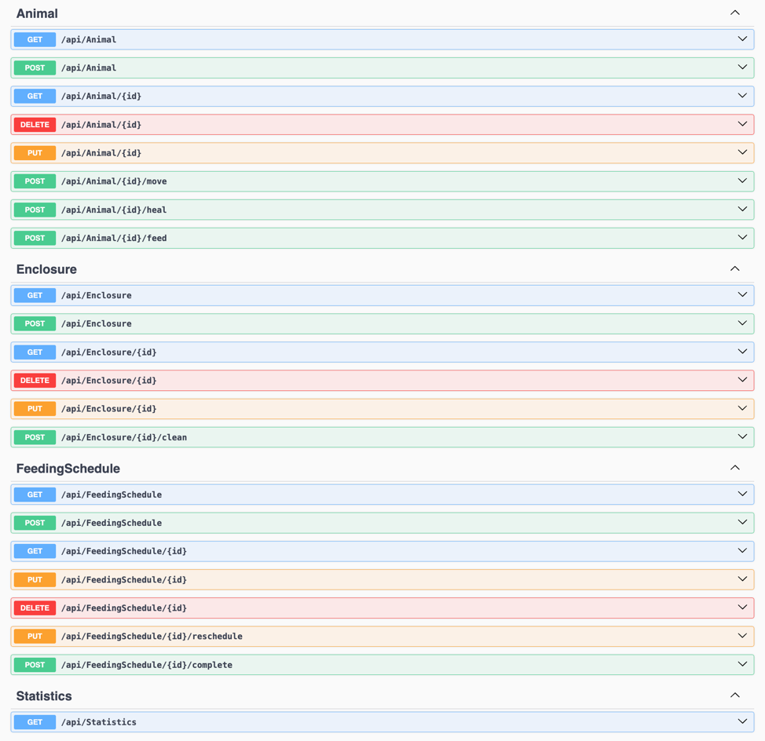

# КПО-МиниДЗ-№2 | Zoo Application
## Выполнено студентом БПИ238, Асланян Давид

---

## **Введение**

Было разработано с нуля полнофункциональное веб‑приложение 
для Московского зоопарка на платформе **ASP.NET Core (C#)**, 
строго следуя принципам **Clean Architecture (чистой архитектуры) и 
Domain-Driven Design (DDD)** – предметно-ориентированного 
проектирования. 

**Цель проекта** – показать грамотную многослойную 
архитектуру с четким разделением ответственности и 
богатой предметной моделью, которая отражает бизнес-правила зоопарка.

В рамках этого проекта реализованы следующие основные возможности 
через **REST API** (**Use Cases** из условия):
- Добавить / удалить животное
- Добавить / удалить вольер
- Переместить животное между вольерами
- Просмотреть расписание кормления
- Добавить новое кормление в расписание
- Просмотреть статистику зоопарка (кол-во животных, 
свободные вольеры и т.д.).

Архитектура проекта разделена на четкие слои – **Domain, Application, 
Infrastructure, Presentation** – каждый из которых выполняет свою роль. 
Ниже подробнее продемонстрирую устройство каждого слоя, а также, 
как концепции **DDD (такие, как сущности (entities), value objects, 
доменные события (events))** 
и принципы **Clean Architecture** (инверсия зависимостей, отделение 
бизнес-логики от деталей) применяются в реализации. 
Также описан % покрытия бизнес-логики проекта Unit-тестами, который 
составил больше, чем требуемые 65 %.

---

## Карта слоёв (Clean Architecture)


---

## Зачем нужны Clean Architecture и DDD (Domain‑Driven Design)

### Clean Architecture

| Принцип | Объяснение                                                                                   | Что это даёт |
|---------|----------------------------------------------------------------------------------------------|--------------|
| **Dependency Rule** | Код внешнего слоя *никогда* не ссылается на классы внутреннего. Зависимости только «внутрь». | Бизнес‑логика может переехать в другую среду (консоль, gRPC, тесты) без переписывания. |
| **Boundaries=Interfaces** | Взаимодействие слоёв идёт через абстракции, реализуемые во внешних слоях.                    | Зависимость не «утекает» вглубь; легко подменить реализацию (например, In‑Memory → EF Core). |
| **Изоляция фреймворков** | Библиотеки веб‑сервера, БД, логирования — детали. Они живут во внешнем кольце.               | Проект не «прикипает» к ASP.NET или конкретной БД. |
| **Только бизнес‑ценность внутри** | Слой Domain содержит чистые правила и модели.                                                | Минимум побочных эффектов → проще тестировать и развивать. |

> **Правило зависимости можно запомнить так:** *«никакой `using` из внутреннего слоя не должен указывать наружу».*

### Domain‑Driven Design

| Понятие                 | Суть |
|-------------------------|------|
| **Ubiquitous Language** | Одинаковая терминология в коде и в разговоре с экспертами. |
| **Entity**              | Объект, важен по идентичности (`Id`). |
| **Value Object**        | Объект‑значение, важна *сущность*, а не `Id`; иммутабелен. |
| **Aggregate**           | Группа сущностей + VO, имеющая корень и инварианты. |
| **Domain Event**        | Факт, произошедший в модели, публикуемый наружу. |
| **Domain Service**      | Доменная операция, не подходящая ни одной сущности. |
| **Repository**          | Абстракция хранения агрегата. |

Проект **ZooApplication** разбит на несколько логических модулей, соответствующих 
слоям архитектуры:
- **ZooApp.Domain** – слой предметной области (домен): содержит 
бизнес-модели и логику ядра системы.
- **ZooApp.Application** – приложение/сервисный слой: реализует use cases
(сценарии использования) посредством вызова доменной логики, 
определяет интерфейсы репозиториев и сервисов.
- **ZooApp.Infrastructure** – инфраструктурный слой: 
реализация хранилищ и внешних сервисов (в нашем случае – 
in-memory хранилище данных), а также настройка инфраструктурных 
компонентов по DI (Dependency Injection).
- **ZooApp.Presentation** – слой представления: 
веб-слой (Web API) с контроллерами, принимающими HTTP-запросы и 
вызывающими Application-слой. Также здесь настраивается Swagger 
и вся конфигурация ASP.NET Core.

## Domain - слой предметной области
**Domain** содержит все основные модели предметной области зоопарка: 
сущности, value objects, доменные события и бизнес-правила. Этот 
слой представляет сердце приложения, воплощая понятия и правила, 
важные для зоопарка (животные, вольеры, кормление и т.д.). 
Доменный код не зависит от базы данных, UI или других технических 
деталей – 
он сфокусирован только на логике работы с данными предметной области

Все доменные сущности (**ZooApplication.Domain.Entities**) являются **POCO (Plain Old CLR Object)** классами – 
без наследования от инфраструктурных базовых классов, без атрибутов 
**ORM** и т.п., чтобы не было ненужных зависимостей. 
Их состояния и поведение полностью управляются внутри доменного слоя

В дополнение к сущностям в **Domain**-слое используются 
**Value Object (объекты-значения -> ZooApplication.Domain.ValueObjects)** для представления некоторых 
примитивных данных, обладающих логикой. **Value Object в DDD** – 
это неизменяемый тип, который определяется значением своих атрибутов, 
не имея собственного идентификатора. 
Он служит для повышения выразительности модели 
и инкапсуляции правил валидации или поведения для простых значений.

**Value Objects** улучшают модель тем, что делают код понятным на 
уровне домена (сразу видно, что требуется AnimalName вместо просто 
string) и гарантируют самовалидность: объект не может существовать в 
недопустимом состоянии. Кроме того, они неизменяемы и не имеют 
собственного идентификатора, что упрощает их использование и сравнение.

Важной частью **DDD** являются **Domain Events (ZooApplication.Domain.Events)** 
– доменные события, 
которые отражают существенные факты или изменения в предметной области. 
Когда в системе происходит что-то значимое с бизнес-точки зрения, 
объект может сгенерировать соответствующее событие и оповестить другие 
части системы об этом факте. Это способствует слабой связанности 
между компонентами: объект, инициирующий событие, не знает, кто и 
как будет реагировать на него – 
он лишь объявляет о событии, а обработчики (listeners) реагируют.

---

## Application – прикладной слой (use cases и services)

### Зачем нужен слой Application

| Задача | Что делает слой |
|--------|-----------------|
| **Координация** | Собирает шаги use‑case’а: читает вход, вызывает методы сущностей, работает с репозиториями. |
| **Изоляция** | Скрывает Presentation‑детали от Domain и наоборот (через интерфейсы). |
| **Транзакционность** | Здесь удобно открывать/фиксировать Unit of Work, если понадобится реальная БД. |
| **Тестируемость** | Логику сценариев можно юнит‑тестировать, подменяя инфраструктуру моками. |

### Структура каталога `Application`

| Папка / файл            | Содержание                                                                                                         | Назначение                                                                                         |
|-------------------------|--------------------------------------------------------------------------------------------------------------------|----------------------------------------------------------------------------------------------------|
| **BackgroundServices/** | `FeedingScheduleWatcher.cs`                                                                                        | Фоновый `HostedService`, каждые 30 с проверяет расписания и генерирует событие `FeedingTimeEvent`. |
| **Dispatcher/**         | `DomainEventDispatcher.cs`                                                                                         | Универсальный диспетчер доменных событий (адаптер `IMediator`).                                    |
| **DTO/**                | `ZooStatisticsDto.cs`                                                                                              | DTO‑объекты (ZooStatisticsDto), которые возвращают сервисы (не доменные сущности!).                |
| **Handlers/**           | `AnimalMovedEventHandler.cs`, `FeedingTimeEventHandler.cs`                                                         | Реакция приложения на доменные события (логирование, побочные эффекты).                            |
| **Interfaces/**         | Интерфейсы <br/>• Репозитории<br>• Сервисы приложений<br>• `IDomainEventDispatcher`                                     | Абстракции, **на которые** зависит Application.<br>Реализуются во внешних слоях.                   |
| **Services/**           | `AnimalService`, `EnclosureService`, `AnimalTransferService`, `FeedingOrganizationService`, `ZooStatisticsService` | Основные _use‑case_‑сервисы. Используют репозитории + доменную модель.                             |

### Поток обработки запроса («Переместить животное»)

1. **`AnimalController.Move()`** (слой Presentation) получает HTTP‑запрос.
2. Вызывает **`IAnimalTransferService.TransferAnimal()`** (Application).
3. Сервис:
    - Берёт `Animal` и `Enclosure` через репозитории.
    - Валидирует типы, вызывает `Enclosure.RemoveAnimal()` / `AddAnimal()`.
    - Добавляет `AnimalMovedEvent` в агрегат.
    - Передаёт список событий `IDomainEventDispatcher`.
4. Диспетчер публикует событие через MediatR →  
   **`AnimalMovedEventHandler`** пишет лог.
5. Контроллер возвращает результат клиенту.

### Поток обработки расписаний («Наступило время кормления»)
1. **FeedingScheduleWatcher** (**Application** → **BackgroundService**) раз 
в 30 секунд опрашивает **IFeedingScheduleRepository**.
2. Для каждой записи, у которой
`!IsCompleted && FeedingTime <= DateTime.UtcNow`, формирует **FeedingTimeEvent и передаёт список в
IDomainEventDispatcher.Dispatch()**.
3. Диспетчер публикует событие через **MediatR** →
**FeedingTimeEventHandler (Application.Handlers)**:
   - Загружает животное через **IAnimalRepository** и вызывает `Animal.Feed()`. 
   - Помечает расписание выполненным `FeedingSchedule.MarkAsCompleted()` и обновляет репозиторий. 
   - Пишет информационный лог.
4. Обновилась информация о будущих кормлениях.
   

### Принципы, соблюдённые в слое

* **SRP** – каждый сервис обслуживает один use‑case.
* **DIP** – завязан на абстракции репозиториев, а не на их реализацию.
* **CQRS‑минимализм** – чтения (`GetAll`, `GetStatistics`) и команды (`TransferAnimal`) разведены по методам.
* **Domain Events** – инфраструктурные реакции вынесены из модели в Application‑handlers.

### Вывод

**Application-слой** – это прослойка между контроллерами и доменом. 
Он формирует API для внутреннего использования (для контроллеров, 
других частей системы), описывая, что нужно сделать (методы сервисов), 
и использует доменные объекты, как это сделать. Здесь концентрируется 
логика сценариев (use case), но сами бизнес-правила делегируются домену. 
Это также место, где можно реализовать управление транзакциями – 
например, если бы был реальный БД, вы бы открывали транзакцию, 
вызывали несколько методов репозиториев, фиксировали транзакцию. 
В нашем случае с in-memory это не столь актуально, но закладывает возможность.

---

## Infrastructure – инфраструктурный слой

В чистой архитектуре **Infrastructure** — самый внешний круг.  
Он содержит технические детали (доступ к БД, файлы, 
внешние API), реализуя **интерфейсы**, объявленные во внутренних 
слоях (*Application* / *Domain*).  
В проекте этот слой изолирован: остальные части 
зависят **только** от интерфейсов, а конкретные классы 
**Infrastructure** «вкручиваются» через **DI‑контейнер**.

| Файл | Назначение                                                                                                              |
|------|-------------------------------------------------------------------------------------------------------------------------|
| `Repositories/InMemoryAnimalRepository.cs` | Простое in‑memory‑хранилище для сущностей **`Animal`**. Реализует `IAnimalRepository`. Действия, связанные с животными. |
| `Repositories/InMemoryEnclosureRepository.cs` | Хранилище для **`Enclosure`**. Реализует `IEnclosureRepository`. Действия, связанные с клетками (вольерами).            |
| `Repositories/InMemoryFeedingScheduleRepository.cs` | Коллекция **`FeedingSchedule`**. Реализует `IFeedingScheduleRepository`. Действия, связанные с расписаниями кормлений.  |
| `DependencyInjection.cs` | Центральная регистрация зависимостей слоя                                                                               
### Ключевые моменты

* **Инверсия зависимостей** – интерфейсы объявлены во внутреннем слое *Application*, их реализация находится во внешнем слое. *Domain* и *Application* **не знают** о `InMemory*Repository`.
* **Заменяемость** – вместо in‑memory можно подключить, например, `EfCoreAnimalRepository`; бизнес‑код при этом не изменится.
* **Отсутствие бизнес‑правил** – в Infrastructure допускается только техническая валидация, связанная с хранением данных.

Таким образом **Infrastructure‑слой** замыкает зависимости наружу, оставляя *Domain* и *Application* чистыми и легко тестируемыми.

---

# Presentation – слой представления (Web API)

**Слой представления – это Web API**, через который внешние 
пользователи (клиенты) взаимодействуют с системой. 
Использован **ASP.NET Core Web API** для построения **RESTful** 
интерфейса. Этот слой включает:
- Контроллеры (Controller classes), каждый из которых отвечает за 
определенный набор конечных точек (endpoints) – URL запросов 
– связанных с конкретной сущностью или функционалом. 
- Конфигурацию приложения: запуск, настройка сервисов, 
подключение Swagger, маршрутизация и др.

## Presentation → Controllers
Контроллеры не содержат бизнес-логики; их задача – принять 
HTTP-запрос, вызывать соответствующие методы **Application-слоя**, 
и вернуть результат пользователю (в виде **HTTP-ответа с JSON**). 
Контроллер – это всего лишь переводчик внешнего мира во 
внутренние вызовы. Такая организация следует принципу единственной 
ответственности и рекомендациям **DDD**: контроллеры (UI) 
не должны напрямую выполнять бизнес-логику, они должны лишь 
обращаться к ней.

| Класс                       | Назначение                                              |
|-----------------------------|---------------------------------------------------------|
| `AnimalController`          | Реализация контроллера работы с животными.              |
| `EnclosureController`       | Реализация контроллера работы с клетками (вольерами).   |
| `FeedingScheduleController` | Реализация контроллера работы с расписаниями кормлений. |
| `StatisticsController`      | Реализация контроллера работы со статистикой.           |

Важно, что контроллеры остаются тонкими – практически каждая их 
строк либо вызывает метод сервиса, либо проверяет результат и 
формирует ответ. Нет дублирования логики, всё сосредоточено в 
одном месте. Это сделано умышленно, чтобы поддерживать принцип 
**Single Responsibility и чистого кода**.

## Presentation → Models

В папке `Presentation/Models` находятся модели для HTTP-запросов, чтобы
принять в контроллере данные:

| Класс                         | Назначение                                                    |
|-------------------------------|---------------------------------------------------------------|
| `CreateAnimalRequest`         | Данные для создания нового животного.                         |
| `UpdateAnimalRequest` (или `AnimalRequest`) | Данные для полной или частичной замены информации о животном. |
| `EnclosureRequest`            | Данные для создания/обновления вольера.                       |
| `FeedingScheduleRequest`      | Данные для создания или полного обновления записи кормления.  |
| `RescheduleFeedingRequest`    | Новый `FeedingTime` для уже существующей записи кормления.    |
| `UpdateAnimalRequest`         | Правка полей животного.                                       |

## Описание API Endpoints:

### Animal

| Method | URL                         | Description                                                                                                                                                    |
|--------|-----------------------------|----------------------------------------------------------------------------------------------------------------------------------------------------------------|
| GET    | `/api/Animal`               | Получить список всех животных                                                                                                                                  |
| POST   | `/api/Animal`               | Создать новое животное   - нельзя будет создать в клетку, где уже и так максимальное число животных и нельзя, например создать хищника в клетку с травоядными. |
| GET    | `/api/Animal/{id}`          | Получить информацию по одному животному (by ID)                                                                                                                |
| DELETE | `/api/Animal/{id}`          | Удалить животное (by ID)                                                                                                                                       |
| PUT    | `/api/Animal/{id}`          | Обновить данные животного   (by ID)                                                                                                                            |
| POST   | `/api/Animal/{id}/move`     | Переместить животное в другой вольер (by ID + Target Enclosure ID)                                                                                             |
| POST   | `/api/Animal/{id}/heal`     | Вылечить (поменять статус) (by ID)                                                                                                                             |
| POST   | `/api/Animal/{id}/feed`     | Покормить животное   (by ID)                                                                                                                                   |

---

### Enclosure

| Method | URL                             | Description                                                                                                                                                                                                                           |
|--------|---------------------------------|---------------------------------------------------------------------------------------------------------------------------------------------------------------------------------------------------------------------------------------|
| GET    | `/api/Enclosure`                | Получить список всех вольеров                                                                                                                                                                                                         |
| POST   | `/api/Enclosure`                | Создать новый вольер                                                                                                                                                                                                                  |
| GET    | `/api/Enclosure/{id}`           | Информация по одному вольеру   (by ID)                                                                                                                                                                                                |
| DELETE | `/api/Enclosure/{id}`           | Удалить вольер          (by ID)   - если удалить клетку, в которой животные, то животные этой клетки автоматически удалятся тоже.                                                                                                     |
| PUT    | `/api/Enclosure/{id}`           | Обновить свойства вольера     (by ID)  - если уже в клетке есть травоядные, то тип клетки нельзя будет сделать, например для хищников, и еще нельзя сделать вместимость клетки меньше, чем количество животных, которые там уже есть. |
| POST   | `/api/Enclosure/{id}/clean`     | Провести уборку вольера     (by ID)                                                                                                                                                                                                   |

---

### FeedingSchedule

| Method | URL                                   | Description                                                                                                                                                                                                                                                |
|--------|---------------------------------------|------------------------------------------------------------------------------------------------------------------------------------------------------------------------------------------------------------------------------------------------------------|
| GET    | `/api/FeedingSchedule`                | Получить все записи расписания кормления                                                                                                                                                                                                                   |
| POST   | `/api/FeedingSchedule`                | Добавить новую запись в расписание                                                                                                                                                                                                                         |
| GET    | `/api/FeedingSchedule/{id}`           | Получить одну запись расписания      (by ID)                                                                                                                                                                                                               |
| PUT    | `/api/FeedingSchedule/{id}`           | Обновить информацию о расписании кормления (by ID)                                                                                                                                                                                                         |
| PUT    | `/api/FeedingSchedule/{id}/reschedule`| Перепланировать время кормления     (by ID)                                                                                                                                                                                                                |
| POST   | `/api/FeedingSchedule/{id}/complete`  | Отметить запись как выполненную     (by ID)     - это вспомогательная ручка, которая используется для реализации event - выполнение кормления происходит в тот момент, когда наступает время кормления и тогда становится complete и пишется лог в консоль |
| DELETE | `/api/FeedingSchedule/{id}`           | Удалить запись расписания       (by ID)                                                                                                                                                                                                                    |


Пометка: если удалять животное или целый вольер с животными, то удалятся эти животные и заодно расписания на их кормления.

---

### Statistics

| Method | URL                  | Description                             |
|--------|----------------------|-----------------------------------------|
| GET    | `/api/Statistics`    | Получить сводную статистику по зоопарку |

Пометка: можно прослеживать актуальное число животных, вольеров, распределение в количестве животных по вольерам и число
грядущих кормлений, которое обновляется после добавления расписания (инкремент) или после его выполнения (дикримент).

---

# Unit тесты
Тесты написаны в отдельном проекте `TestZooApp` данного решения `ZooApp`

Использовался фреймворк для модульного тестирования **`xUnit`**

Использовались `Fact` атрибуты для тестов.

Покрытие бизнес-логики проекта составило 94%, что больше требуемых в условии 65%




Для проверки покрытия тестами воспользовался в этот раз
бесплатным сервисом - XPlat Code Coverage (потому что подписка на
JetBrains закончилась....(печалька)) Он генерит процент покрытия в HTML.

Вот инструкция по проверке покрытия (в терминале):
1. переходим в проект TestZooApp: ```cd TestZooApp```
2. Запускаем эти команды:
    ```aiignore
    dotnet clean
    dotnet build
    dotnet test --collect:"XPlat Code Coverage"
    ```
3. Выведется сообщение о кол-ве пройденный тестов,
   а так же вложение такого формата: ```/Users/david/Desktop/ВШЭ/C#/ZooApp/TestZooApp/TestResults/3fe53556-f288-47cf-9b5a-c0b01c1f6590/coverage.cobertura.xml```
4. Далее запускаем команду ```reportgenerator -reports:"/Users/david/Desktop/ВШЭ/C#/ZooApp/TestZooApp/TestResults/3fe53556-f288-47cf-9b5a-c0b01c1f6590/coverage.cobertura.xml" -targetdir:"coverage-report" -reporttypes:Html -classfilters:"-*Program*;-*Controller*"```
   Тут путь должен быть таким, как был сгенерирован во вложении, описанном в 3 пункте.
5. Теперь запускаем команду ```open coverage-report/index.html```
6. Нас перебрасывает на HTML страницу с результатами покрытия

Если вдруг на этапе выведется это ```zsh: command not found: reportgenerator``` -
тогда введите в консоль команду ```export PATH="$PATH:/Users/david/.dotnet/tools"```

Флаг ```-classfilters:"-*Program*;-*Controller*"``` говорит о том, что мы исключаем Program.cs и Controllers и тестируем бизнес-логику исключительно.

---

# Summary 

Разработаны классы доменной модели согласно концепции 
Domain-Driven Design

Построена структура проекта, соблюдая принципы Clean Architecture.

В слое представления (Web API в архитектурном стиле REST API) реализовать следующие
контроллеры:


Хранение данных организовано в виде in-memory хранилища (Infrastructure Layer)


**Принципы чистой архитектуры:**

1) Соблюдено разделение на слои и направление зависимостей
   Есть слои:
   – Domain: модели, Value Objects, Domain Events.
   – Application: сервисы бизнес‑логики, интерфейсы репозиториев.
   – Infrastructure:
   классы реализации репозиториев (InMemory*Repository), DI‑конфигурация (DependencyInjection).
   – Presentation: Web API‑контроллеры.

2) Всё общение между слоями через интерфейсы

3) Отделение бизнес‑логики от инфраструктуры
   – Контроллеры не содержат проверок предметной области, только вызов Application‑сервисов.
   – Application‑сервисы не знают о Web, Console, БД — оперируют только сущностями и репозиториями.
4) Dependency Injection -
   DI регистрирует все зависимости


**Соблюденные концепции DDD (в проекте присутствуют):**

1) Сущности (Entities) богатой доменной модели
   – Animal, Enclosure, FeedingSchedule.
   Каждая имеет собственный Id и поведение
2) Value Objects
   (AnimalType, Capacity, FeedingTime, Food, Gender, HealthStatus, Name)
   Все проверяют свои инварианты в конструкторе (непустое имя, не негативная вместимость, время в будущем и т.д.).
3) Доменные события (Domain Events)
   – AnimalMovedEvent, FeedingTimeEvent.
   События описаны, могут содержать ссылку на сущность и дополнительную информацию
4) Ядро предметной области (Domain) не зависит ни от кого
   – все зависимости (репозитории, логирование, хостинг) находятся в вышележащих слоях.

**Тестирование бизнес-логики проекта выполнено с покрытием в 94 %**

**Таким образом все условия выполнены!**
